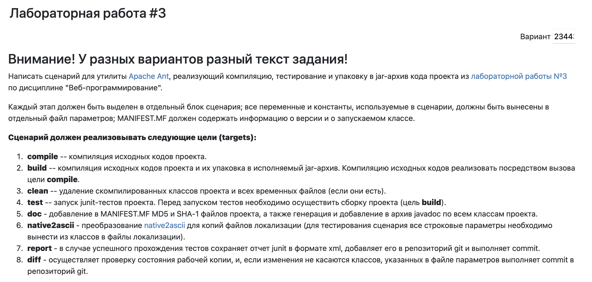

# WEB_LAB3_OPI

Лабораторная работа №3 по дисциплине "ОПИ"
Вариант: **234439**

## Условие



## Конфигурация

Основные пути и параметры вынесены в `build.properties`.

- `src/main/java` — исходный код
- `src/main/resources` — ресурсы
- `src/main/webapp` — web-файлы
- `src/test/java` — тесты
- `lib` — зависимости
- `ant/build` — временная сборочная директория
- `dist` — итоговые архивы и документация
- `reports` — JUnit XML-отчёты
- `report` — копия отчёта для Git
- `alt-src` — исходные файлы локализации
- `alt-build` — результат `native2ascii`

## Targets из условия

### `compile`

Компилирует Java-код из `src/main/java` в:

```text
ant/build/WEB-INF/classes/
```

Перед компиляцией копирует ресурсы из `src/main/resources` в ту же директорию. Использует зависимости из `lib`, Lombok и MapStruct annotation processors.

---

### `build`

Собирает проект в `jar` и `war`.

Создаёт обычный manifest:

```text
dist/MANIFEST.MF
```

Создаваемые архивы:

```text
dist/WEB_LAB3_OPI.jar
dist/WEB_LAB3_OPI.war
```

Во временную директорию `ant/build` копируются web-файлы, `web.xml`, классы и библиотеки из `lib`.

---

### `clean`

Удаляет результаты сборки:

```text
ant/build/
dist/
reports/
report/
alt-build/
failed_revision_diff.patch
*.md5
*.sha1
```

---

### `test`

Компилирует тесты из `src/test/java` в:

```text
ant/build/test/classes/
```

Запускает JUnit-тесты по шаблону:

```text
**/*Test.java
```

XML-отчёты создаются в:

```text
reports/
```

Тест `ArgumentValidatorTest` проверяет:

- валидный `Dot` проходит проверку;
- `null` вызывает `IllegalArgumentException`;
- `NaN` в `x`, `y`, `r` вызывает `IllegalArgumentException`;
- `Infinity` в `x`, `y`, `r` вызывает `IllegalArgumentException`.

---

### `doc`

Генерирует Javadoc в:

```text
dist/javadoc/
```

Создаёт контрольные суммы исходных `.java` файлов:

```text
ant/build/checksums/
```

Для `doc` используется отдельный manifest:

```text
dist/DOC-MANIFEST.MF
```

Он отличается от обычного `MANIFEST.MF`, кроме стандартных полей содержит списки контрольных сумм:

- `Project-MD5`
- `Project-SHA1`

Создаёт `jar` с классами и Javadoc:

```text
dist/WEB_LAB3_OPI.jar
```

---

### `native2ascii`

Преобразует файлы локализации из:

```text
alt-src/
```

в:

```text
alt-build/
```

---

### `report`

Выполняет `build` и `test`.

Проверяет наличие отчёта:

```text
reports/TEST-org.example.ArgumentValidatorTest.xml
```

Копирует его в:

```text
report/TEST-org.example.ArgumentValidatorTest.xml
```

---

### `diff`

Проверяет рабочую копию Git.

Использует правила из:

```text
git-ignore.properties
```

Создаёт diff-файл:

```text
failed_revision_diff.patch
```

Если запрещённых изменений нет, выполняет commit.
Если запрещённые изменения найдены, завершает выполнение ошибкой.

## Дополнительные targets

### `start`

Запускает Docker-контейнер PostgreSQL:

```bash
docker start lab-postgres
```

---

### `check`

Показывает запущенные Docker-контейнеры:

```bash
docker ps
```

---

### `deploy`

Зависит от `build`.

Копирует:

```text
dist/WEB_LAB3_OPI.war
```

в директорию деплоя WildFly:

```text
~/Downloads/wildfly-39.0.0.Final/standalone/deployments
```

---

### `run`

Запускает WildFly:

```text
~/Downloads/wildfly-39.0.0.Final/bin/standalone.sh
```

---

### `open`

Выполняет:

```text
start -> check -> run -> deploy
```

После деплоя открывает приложение:

```text
http://localhost:8080/WEB_LAB3_OPI/
```
